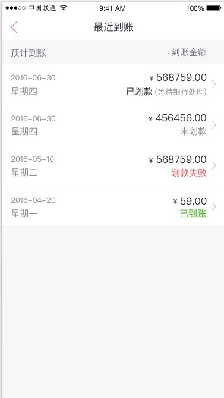
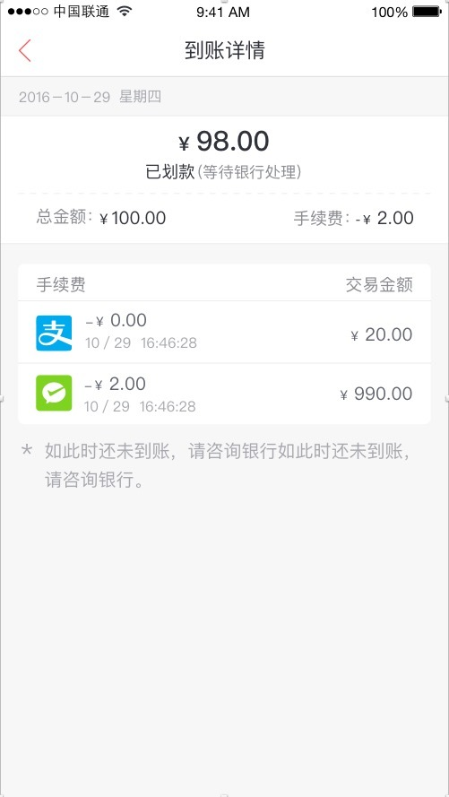

最近几天，在做一个类似列表的一个界面，在做的时候碰到了很多问题和总结了一些经验，在这里有必要记录一下。

 

###遇到的问题

页面看起来并不复杂，可以后台返回的数据并不是很完整，所以遇到了一些问题，有的问题在我看来不是很难我这里就不再描述了（以我的水平如果觉得不难那一定是非常简单了。。。 - -），具体有以下四个问题：

1. 后台返回的交易类型有三种，根据每种交易类型展示不同的图片，可以参考上面到账详情那张图片。
2. 请看最近到账那张图片，列表的到账状态有四种，根据不同的状态展示的文字颜色需要不一样。
3. 后台返回的金额都是以分为单位的，而页面上展示的是以元为单位的。
4. 后台并没有给返回星期几，所以这个也需要自己来做判断。
5. 详情页面的有些信息后台并没有返回给你，必须从列表页面来获取这些信息运用到这个界面上。

这就是遇到的几个比较让我头疼的问题，截止到现在已经解决了大部分的问题，还没有解决的一个问题也有了一个基本的思路。下面我来简单说一下每个问题的解决办法。

####1. 问题一和问题二

问题一和二，其实就是模板语言上面的问题，现在加载页面有一些页面上要展示出来的数据其实是后台返回给你的。所以你要预先读取这些数据并渲染到你的页面上。基本做前端的同学应该都会用到模板语言，而我用的是`handlebars`这个模板语言（其实解决这个问题的办法是换一个模板语言，最后我会简单的说一下），我主要是描述一下用`handlebars`这个模板语言是怎么解决的。

`handlebars`当中的`{{#if}}`只能进行简单的这个变量的有无来进行判断，而不能在`if`当中加一些参数的判断，所以这里我们需要引用`handlebars helper`，在我理解这个其实就是用来补充`handlebars`中的不足的，在`handlebars helper`中可以进行一些复杂的判断，以我用的这个`helper`为例来分析一下。



//这里是注册了一个新的helper，名字叫做compare，而这个helper接受了三个参数，第一个和第二个参数是必填的，第三个参数是选填的
Handlebars.registerHelper("compare",function(v1,v2,options){
	 //比较参数  满足条件添加继续执行
    if(v1 == v2){
        return options.fn(this);
    }else{
    //不满足条件执行{{else}}部分
        return options.inverse(this);
    }
});



如上代码，注释写在了里面，我只想说一下`options.fn(this)`，其实这个意思就是执行下面的部分，这个部分其实不是在我们的js函数中，而是在我们引用这个`helper`的那个html页面中出现`{# compare}`的这个地方。看如下代码：



//比较type是不是card
   {#compare type 'card'}
      
     {else}
      
   {/compare}



如上，这个就是我在html页面的部分代码，`options.fn(this)`的功能就是执行`{# compare}`和`{else}`之间的代码。（以我浅显的理解，通俗的解释。。。。。）。

PS:少写了一个花括号是因为双花括号不会显示出来不知道为什么。。。。

###学习到的经验

####1. 添加标识符

在写`ajax`的时候，在`ajax`的不同阶段，应该设置一个标识符来进行标识，以`jquery`的`ajax`为例，比如：`beforeSend`，`success`，`complete`等等不同的阶段，对发送`ajax`的状态来进行标识。

这个经验其实是这样的：我在设置下拉加载更多的时候，发现有的时候可能会发出多次请求，如果我们在程序里加上一个标识符，就可以避免这个问题的发生，如下代码：



        beforeSend: function(){
            loading = true;
        },
        success: function(data){
                page += 1;
        },
        complete: function(){
            loading = false;
        }



如上代码这个只是举一个例子，并不是全部代码，逻辑大概是这样，当页面滑到底部，就发出一个请求请求`page+1`页的数据。如果我一次下拉发出多次请求的话，在`success`中的`page`就会累加多次，出现错误。如果我们添加了标识符后，当只有`loading`结束的时候才去发送下一次请求，所以当一些特殊情况比如网络不好的情况下，下拉了多次而`ajax`还没有发送成功的时候，是不会发送第二次`ajax`请求的。这样就能避免这个问题的产生。

####2. 可以通过url把参数带到下一个页面

就是我在上面遇到的第五个小问题，有些时候我们在这个页面获得了一些数据，但是我们在去往下一个页面的时候还是需要这些数据的时候怎么办？

这时候就需要把我们需要的数据拼接到`url`当中，在到了下一个页面的时候，再把`url`中的参数分离出来，调用我们需要的一些参数。

分离`url`参数的方法贴在下面，供大家参考。



var getQuery = function(){
    var url=location.search;
    var Request = {};
    if(url.indexOf("?")!=-1)
    {
        var str = url.substr(1);
        strs = str.split("&");
        for(var i=0;i<strs.length;i++)
        {
            var _key = strs[i].split("=")[0];
            Request[_key]=strs[i].split("=")[1];
        }
    }
    return Request;
};



如上代码，我们把`url`中`?`号部分后面的参数分离出来，组成一个对象，在需要哪个参数的时候，我们只要调用`getQuery`中对应的属性就可以了。

####3. 如果url所带的参数中有汉字怎么办

在我携带参数的时候，有的参数可能是汉字，而在参数带到下一个页面后，如果调用这个参数的话，会出现乱码类似于`%E5%B7%A5%E4`这样的。其实这个不是乱码，而是浏览器所做的`encodeURI编码`，而我们所要做的就是只要把它`decodeURI`解码后，我们就可以在下一个页面中正常的使用了。

####4. handlebars helpers的学习

今天时间不够了。。。改天再补上。。。。